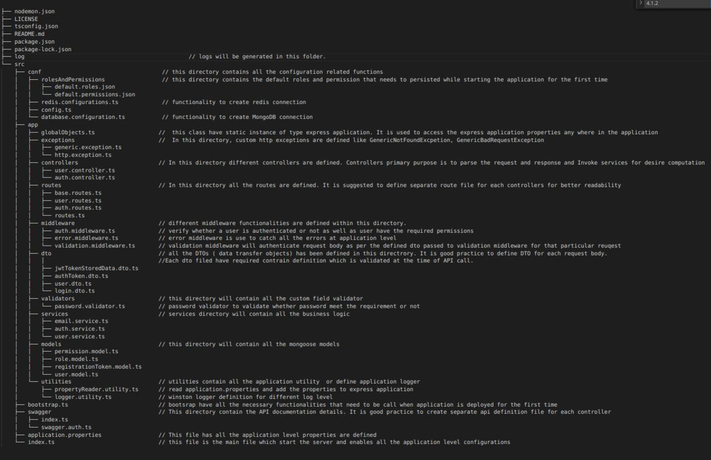

# NodeJs-TypeScript Starter Project

This project could be a good base project for developing Express/Node.js and MongoDB application using TypeScript on top of it. This project have following functional implementation
1. Database Configuration ( MongoDB and Redis )
2. Winston Logger Configuration
3. Middleware validation of the request body to keep the business logic clean
4. Activity/Permission based Authorization
5. Token-based Authentication
6. Custom validator annotation like Password validation
7. Custom Exception Handling
8. Swagger Implementation for API documentation
9. Property file implementation which will include all the environment and configuration variable detail and facilitate any changes in configuration from this file only.

# Directory Structure

# Project Set-up

Assuming that git and node.js is installed in the development environment. Please do the necessary changes for database connection and other configuration in application.properties file

**Clone the repository**
$ git clone <git url>

**Install necessary packages**
$ npm install

**Run the application in development environment**
$ npm run-script start:dev

# Project deployment

**Install necessary packages**
$ npm install

**Install PM2**
npm install pm2@latest -g

**Run the application**
npm run-script start:pm2